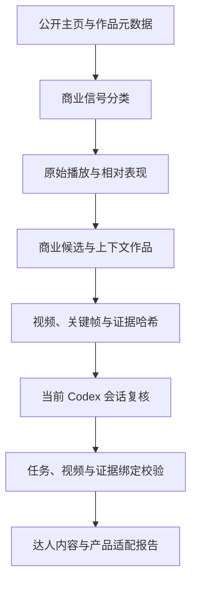

# TikTok 达人商业内容分析

**从公开作品判断商业内容能力，保留表现口径、视频证据和产品适配依据。**

找达人时，只看粉丝和最高播放量很容易看错方向。一个账号的爆款可能与产品演示无关，挂链也不一定意味着付费合作；同样的播放量放在不同账号、不同发布阶段，含义并不相同。

这个项目把筛选拆成可以检查的几个步骤：取得公开元数据，区分商业信号，计算账号与局部基线，挑选需要深看的视频，准备画面与声音证据，再形成产品适配和沟通建议。

Python 负责整理与计算，当前 Codex 会话负责基于素材的结构化复核。两者通过任务文件、视频标识和证据哈希绑定，减少把旧判断接到新产品或新素材上的风险。

## 希望回答哪些问题

| 问题 | 需要看的依据 |
| --- | --- |
| 达人有没有拍过商业内容 | 广告披露、商品相关字段、文本和画面证据 |
| 商业内容表现如何 | 原始播放量、账号中位数与相邻作品基线 |
| 产品怎样进入视频 | 钩子、演示、证明、口播、剪辑和 CTA |
| 是否适合当前产品 | 产品简报、授权图片、目标人群与已复核作品 |
| 有什么不能确定 | 缺失字段、下载失败、无法观察的合作关系与转化信息 |

报告关注的是公开内容与观察到的表现，不把播放量换算成真实销量，也不凭挂链认定付费关系。

## 一个产品筛选任务

假设要为便携保温杯寻找合适的内容合作对象，先提供达人主页、产品说明、卖点与目标人群：

```powershell
creator-intel prepare-codex "https://www.tiktok.com/@creator" --limit 30 --top 5 --product-name "便携保温杯" --product-description "通勤携带与保温演示" --selling-point "便携" --target-audience "日常通勤人群"
```

主页地址和产品为说明参数的示例，需要换成实际目标。该命令整理公开证据，输出复核任务、要求与结果结构；它本身不会调用当前会话完成视觉分析。

随后在 Codex 中读取任务与证据，按要求提交结构化复核。最后使用 `finalize-codex` 校验复核文件并生成报告。准备、观察和完成分别有状态，不应在第一步结束时就说“已经分析过视频”。

## 分析流水线



元数据、媒体准备、复核结果和最终报告是不同产物。某个媒体步骤失败时，错误进入任务记录，不能用只有元数据的结果冒充已看过画面。

## 商业信号怎样区分

明确的广告披露、商品挂链、商业文本与内容推断有不同强度。分类器保存信号和规则判断，区分已确认、较可能、可能等层级。

一个作品可能展示商品但没有公开付费关系；也可能有商品入口却缺少可确认的广告披露。报告应把“看到什么”和“据此推断什么”分开。

规则实现位于 [commercial.py](src/creator_intel/commercial.py)，对应测试包含多种信号组合。仓库提供离线分类 benchmark 入口，输出基于固定人工标注样例的混淆报告；它不能直接代表当前平台上所有内容的准确率。

## 播放量：同时保留绝对值与参照

### 整体基线

先对可用作品计算账号整体播放中位数，并保留分位数与样本信息。中位数降低单条极高值对基线的影响，但仍受取得的作品范围和时间段影响。

### 相邻作品基线

单条作品还参考相邻作品窗口：当前实现窗口参数为 10，排除作品自身，至少需要五个有效邻近样本。数量不足时回退到整体中位数。

这样可以观察某条商业作品相对当时账号表现的变化，避免仅用账号早期或近期差异很大的总体水平解释全部视频。

### 缺失与无效分母

原始播放、整体相对值与局部相对值分别保存。没有有效播放或分母不可用时，比例保留为空，不能硬算成零或极高倍数。

以下只用于说明计算含义：

```text
某作品播放量：20,000
可用邻近作品中位数：10,000
相对表现：2.0
```

这是示意数字，不是某个真实达人的报告；2.0 只表示在这份样本中的相对播放，不能证明商业合作带来了增量或转化。

## 候选选择与上下文视频

`performance.py` 结合商业概率、原始播放量的对数、局部相对表现和商品相关信号，为深看候选建立排序。CLI 的不同路径还保留最高播放商业候选等选择方式，应按实际命令的语义理解。

商业视频之外，`prepare-codex` 可以准备自然内容 / 上下文作品，帮助判断达人平时的表达方式。只看商业候选，容易把日常人设、叙事节奏与商业内容的差异漏掉。

选择候选是减少阅读量的工具，不是最终达人排名。样本覆盖不足、平台缺字段或采集失败，都应该影响报告中能作出的判断。

## 两阶段 Codex 复核

### `prepare-codex`：建立本轮证据

每轮有独立运行目录，保存产品简报、任务摘要、视频与素材信息。准备过程生成复核要求、JSON 结构与预期输出位置；证据包含内容哈希，帮助核对复核使用的文件。

产品图片可重复指定 `--product-image`，卖点和目标人群也支持重复参数。这样产品适配判断不必只依赖一个短标题。

### 当前会话：根据素材观察

复核记录开头钩子、演示动作、证明方式、镜头与剪辑、口播、CTA，以及产品如何进入内容。事实、推断和未知分开保存。

不能根据文件名推断画面，也不能因为字幕说了某个卖点，就认定视频已经展示了对应证明。无法读取的媒体保留失败状态。

### `finalize-codex`：绑定并校验

最终化时校验任务与视频标识、任务摘要、证据路径与哈希，以及本轮产品信息。结构化结果需与当前任务对应，旧任务的复核不能直接接到新的产品上。

输出报告包括内容观察、表现参照、产品适配依据和沟通建议。它仍是内容研究，无法取得没有公开的数据来证明合作费用或真实转化。

## 媒体与失败恢复

媒体处理、缓存和报告阶段分别记录状态。缓存能减少重复处理，但 `--force`、`--no-cache` 有不同作用：前者用于重新执行相应完成阶段，后者控制缓存读取。

下载失败、公开字段不足或模型路径失败，都应留下明确错误。单条视频也有独立 `analyze-video` 入口，便于将问题收敛到具体素材；该路径的外部提供方依赖需要另行配置。

## 安装与常用命令

要求 Python 3.11+：

```powershell
python -m venv .venv
.\.venv\Scripts\python.exe -m pip install -e ".[dev]"
.\.venv\Scripts\creator-intel.exe version
```

仅整理元数据，不下载媒体或调用 AI：

```powershell
.\.venv\Scripts\creator-intel.exe analyze-profile "https://www.tiktok.com/@creator" --limit 30 --metadata-only
```

准备当前 Codex 会话要看的证据：

```powershell
.\.venv\Scripts\creator-intel.exe prepare-codex "https://www.tiktok.com/@creator" --limit 30 --top 5 --context-videos 3 --product-description "便携保温杯"
```

完成复核后，用准备阶段实际打印出的路径执行：

```powershell
creator-intel finalize-codex "本轮任务目录/codex_job.json" --review "本轮任务目录/review.json"
```

这里的路径是占位说明，必须使用本轮真实任务和复核文件。当前会话路径不需要在仓库中保存个人 API Key；其他提供方路径可能需要自己的配置。网络、地区、平台可见范围、媒体工具与授权条件仍会影响实际采集。

## 代码与测试地图

| 关注点 | 实现 | 用例 |
| --- | --- | --- |
| 商业信号 | [commercial.py](src/creator_intel/commercial.py) | [test_commercial.py](tests/test_commercial.py) |
| 播放基线与候选 | [performance.py](src/creator_intel/performance.py) | [test_performance.py](tests/test_performance.py) |
| 会话证据与最终化 | [codex_native.py](src/creator_intel/codex_native.py) | [test_codex_native.py](tests/test_codex_native.py) |
| 单视频处理 | [video_pipeline.py](src/creator_intel/video_pipeline.py) | [test_failure_recovery.py](tests/test_failure_recovery.py) |
| 命令与配置 | [cli.py](src/creator_intel/cli.py)、[config.py](src/creator_intel/config.py) | [tests/](tests/) |

在 Codex 中也可以读取根目录 `SKILL.md`，给出公开主页、产品简报和自己有权使用的产品图片，再按证据流程处理。

## 验证范围与限制

2026-10-07 的检查执行了 95 个离线 pytest 用例；需要外部授权的两个集成用例未执行。没有完成真实 TikTok 采集、实际模型复核或产品适配报告的端到端验收，详情见 [检查记录](docs/verification.md)。

公开仓库不包含真实达人研究缓存、客户产品资料、运行报告和个人授权。分类和相对表现都有观察局限，当前系统不承诺合作效果、销售转化或因果结论。
