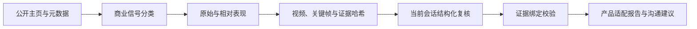

# TikTok 达人商业内容分析

**用公开内容和视频证据判断达人适配度，保留判断依据与缺失信息。**

筛选达人时，粉丝量只能回答一部分问题。我更关心他拍过哪些商业内容，产品怎样进入镜头，这些视频相对他自己的常规表现如何，以及表达方式是否适合目标产品。

项目把这件事拆成两步：Python 整理公开元数据、计算表现、准备视频证据；当前 Codex 会话看画面和字幕，提交结构化复核，再由代码生成报告。

## 数据先准备，判断后提交



`prepare-codex` 生成证据包与复核要求；完成复核后，`finalize-codex` 才会生成最终报告。准备完成的状态有明确边界，不能据此声称已经分析过视频。

## 几个判断口径

- **商业信号有强弱。** 明确广告披露、商品挂链和内容推断分别记录；挂链本身不证明付费合作。
- **表现有参照。** 同时记录原始播放量、账号整体中位数与相邻视频中位数；局部样本不足时回到整体基线，缺失与无效分母保留为空。
- **复核绑定到本次证据。** 每轮有自己的运行目录、任务摘要与素材哈希；最终结果校验任务和视频标识，避免旧产品判断被接到新任务上。
- **失败也属于结果。** 媒体失败和公开字段缺失保留在记录中；报告区分看得到的事实、推断与未知。

报告整理钩子、演示、证明、剪辑、口播和 CTA，再形成产品适配与沟通建议。这里的表现比较是观察指标，不能推出真实转化效果。

## 可以直接看这些实现

| 设计 | 源码与用例 |
| --- | --- |
| 商业信号分类 | [commercial.py](src/creator_intel/commercial.py) · [test_commercial.py](tests/test_commercial.py) |
| 基线、相对表现与候选排序 | [performance.py](src/creator_intel/performance.py) · [test_performance.py](tests/test_performance.py) |
| 两阶段复核与证据绑定 | [codex_native.py](src/creator_intel/codex_native.py) · [test_codex_native.py](tests/test_codex_native.py) |
| 媒体处理与恢复 | [video_pipeline.py](src/creator_intel/video_pipeline.py) · [test_failure_recovery.py](tests/test_failure_recovery.py) |

## 快速开始

要求 Python 3.11+。

```powershell
python -m venv .venv
.\.venv\Scripts\python.exe -m pip install -e ".[dev]"
.\.venv\Scripts\creator-intel.exe version
.\.venv\Scripts\creator-intel.exe prepare-codex "https://www.tiktok.com/@creator" --limit 30 --top 5 --product-description "便携保温杯"
```

也可以在 Codex 中使用根目录 `SKILL.md`，给出公开主页、产品描述和授权产品图片。`prepare-codex` 只准备证据；报告需要完成结构化复核后再由 `finalize-codex` 生成。

`src/creator_intel/` 是实现，`tests/` 包含分类、排序、媒体与故障恢复测试。商业关系判断有不确定性，挂链不等于付费合作，表现关联也不能证明转化因果。真实采集还受地区、公开可见范围和平台变化影响。

## 本次公开整理的检查

见 [检查记录](docs/verification.md)，其中区分源码与语法检查、隔离测试和未执行的真实环境路径。
